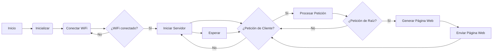
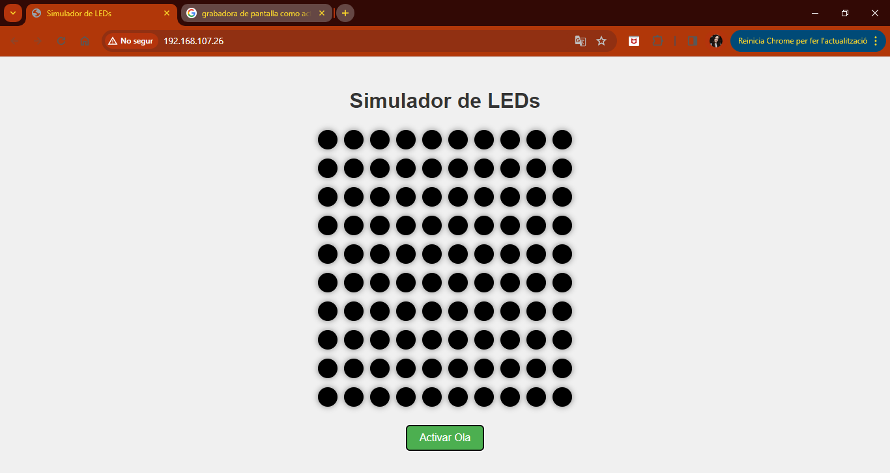
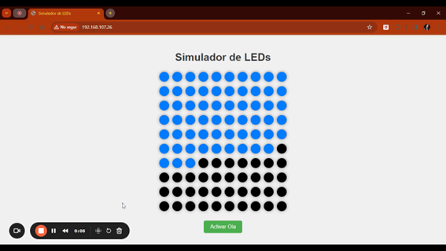

# Practica extra 1.2: Ola de colores simulador Web

## Objetivos: 
- Simular la practica extra 1.1. (ola de colores con LEDs) en una pagina web. 
## Materiales:
- ESP32-S3
### Librerias: 
```ini
    lib_deps =
        WiFi
        WebServer
``` 
## Procedimiento: 
### Principal: 
**Codigo:**
```cpp
    #include <Arduino.h>
    #include <WiFi.h>
    #include <WebServer.h>

    const char* ssid = "RedmiNuria";
    const char* password = "Patata123";

    const int numRows = 10; // Número de filas en la matriz de LEDs de la simulación
    const int numCols = 10; // Número de columnas en la matriz de LEDs de la simulación

    WebServer server(80);

    void handleRoot();

    void setup() {
    Serial.begin(115200);
    WiFi.begin(ssid, password);

    while (WiFi.status() != WL_CONNECTED) {
        delay(1000);
        Serial.println("Conectando al WiFi...");
    }

    Serial.println("Conectado al WiFi");
    Serial.print("Dirección IP: ");
    Serial.println(WiFi.localIP());

    server.on("/", handleRoot);
    server.begin();
    Serial.println("Servidor iniciado");
    delay(100);
    }

    void loop() {
    server.handleClient();
    }
    void handleRoot() {
        server.send(200, "text/html", paginaWeb);
    }
```
**Descripción:**<br>
Establece un servidor web utilizando un dispositivo Arduino y un módulo WiFi. Se definen las credenciales de la red WiFi a la que el dispositivo se conectará, así como el tamaño de la matriz de LEDs, aunque en el código no se utiliza directamente.

La inicialización del servidor web se realiza creando un objeto WebServer que escuchará en el puerto 80, el puerto predeterminado para el tráfico HTTP. Se define una función llamada ``handleRoot()`` que será invocada cuando se acceda a la raíz del servidor. El codigo de la pagina web lo mostraré mas tarde.

En el método ``setup()``, se inicia la comunicación serial para la depuración, se intenta establecer la conexión a la red WiFi especificada y se espera hasta que se logre la conexión. Una vez conectado, se imprime la dirección IP asignada al dispositivo Arduino. Además, se configura un manejador para la ruta raíz del servidor, especificando que se debe llamar a la función handleRoot() cuando se acceda a esta ruta. Finalmente, se inicia el servidor web.

En el bucle principal ``loop()``, se llama al método handleClient() del servidor web, que se encarga de gestionar las solicitudes entrantes. Esto permite que el dispositivo Arduino responda a las solicitudes HTTP mientras sigue ejecutando otras tareas en segundo plano.

### Pagina Web: 
**Codigo:**
```html
    String paginaWeb = "<!DOCTYPE html>\
    <html lang=\"en\">\
    <head>\
    <meta charset=\"UTF-8\">\
    <meta name=\"viewport\" content=\"width=device-width, initial-scale=1.0\">\
    <title>Simulador de LEDs</title>\
    <style>\
        body {\
        font-family: 'Arial', sans-serif;\
        background-color: #f0f0f0;\
        text-align: center;\
        }\
        h1 {\
        color: #333;\
        margin-top: 50px;\
        }\
        .led {\
        width: 30px;\
        height: 30px;\
        border-radius: 50%;\
        display: inline-block;\
        margin: 5px;\
        background-color: black;\
        cursor: pointer;\
        box-shadow: 0 0 10px rgba(0,0,0,0.5);\
        }\
        button {\
        padding: 10px 20px;\
        font-size: 16px;\
        background-color: #4CAF50;\
        color: white;\
        border: none;\
        border-radius: 5px;\
        cursor: pointer;\
        margin-top: 20px;\
        }\
        .led.on {\
        background-color: #007bff;\
        }\
    </style>\
    </head>\
    <body>\
    <h1>Simulador de LEDs</h1>";

    // Generar LEDs
    for (int row = 0; row < numRows; row++) {
        for (int col = 0; col < numCols; col++) {
        paginaWeb += "<div class=\"led\" id=\"led_" + String(row) + "_" + String(col) + "\" onclick=\"toggleLED('led_" + String(row) + "_" + String(col) + "')\"></div>";
        }
        paginaWeb += "<br>";
    }

    // Añadir botón para activar la ola
    paginaWeb += "<button onclick=\"activarOla()\">Activar Ola</button>";

    // Script JavaScript
    paginaWeb += "<script>\
        var leds = document.querySelectorAll('.led');\
        var intervalo;\
    \
        function toggleLED(id) {\
        var led = document.getElementById(id);\
        var estado = led.classList.contains('on');\
        if (estado) {\
            led.classList.remove('on');\
        } else {\
            led.classList.add('on');\
        }\
        }\
    \
        function activarOla() {\
        var contador = 0;\
        intervalo = setInterval(function() {\
            leds.forEach(function(led, index) {\
            var columna = index % " + String(numCols) + ";\
            var fila = Math.floor(index / " + String(numCols) + ");\
            if (fila === contador) {\
                setTimeout(function() {\
                toggleLED('led_' + fila + '_' + columna);\
                }, 100 * columna);\
            }\
            });\
            contador++;\
            if (contador === " + String(numRows) + ") {\
            clearInterval(intervalo);\
            setTimeout(function() { activarOlaReversa(); }, 2000);\
            }\
        }, 500);\
        }\
    \
        function activarOlaReversa() {\
        var contador = " + String(numRows - 1) + ";\
        intervalo = setInterval(function() {\
            leds.forEach(function(led, index) {\
            var columna = index % " + String(numCols) + ";\
            var fila = Math.floor(index / " + String(numCols) + ");\
            if (fila === contador) {\
                setTimeout(function() {\
                toggleLED('led_' + fila + '_' + columna);\
                }, 100 * columna);\
            }\
            });\
            contador--;\
            if (contador === -1) {\
            clearInterval(intervalo);\
            }\
        }, 500);\
        }\
    \
    </script>\
    </body>\
    </html>";
```

**Descripción:**<br>
Iimplementa el simulador de LEDs, diseñado para interactuar con una matriz de LEDs.

Se presenta una serie de LEDs simulados, dispuestos en filas y columnas, con un total de 10 filas y 10 columnas, como se especifica en las variables ``numRows`` y ``numCols`` del código.

Además de los LEDs, se encuentra un botón "Activar Ola", que cuando se presiona, activa una animación de onda que recorre secuencialmente las filas de la matriz de LEDs, encendiendo y apagando los LEDs a medida que avanza la onda.

El script ``JavaScript`` incluido en la página web define las funciones necesarias para controlar la simulación de la onda. La función ``toggleLED()`` se utiliza para cambiar el estado de un LED individual cuando se hace clic en él, mientras que las funciones ``activarOla()`` y ``activarOlaReversa()`` se encargan de iniciar la animación de la onda y su reversa, respectivamente.
### Diagrama de flujos: 

### Salida de la terminal: 
```
    Conectando al WiFi...
    Conectado al WiFi
    Dirección IP: 192.168.107.26
```
## Foto pagina web: 



## Video: 
<video width="640" height="360" controls>
  <source src="OlaColoresPW.mp4" type="video/mp4">
  Tu navegador no admite la reproducción de videos.
</video>
<br>
En caso de que no se muestre el video por GitHub se puede descargar por aqui: 

[](OlaColoresPW.mp4)
## Conclusión: 
En resumen, el código configura un servidor web en un dispositivo Arduino que se conecta a una red WiFi especificada y responde con una página web cuando se accede a la raíz del servidor.
La página web proporciona una interfaz interactiva para simular el comportamiento de una matriz de LEDs, permitiendo a los usuarios encender y apagar los LEDs individualmente, así como activar una animación de onda que recorre la matriz en ambas direcciones como por supuesto, la practica anterior ``1.1. OlaColoresLEDs``. 